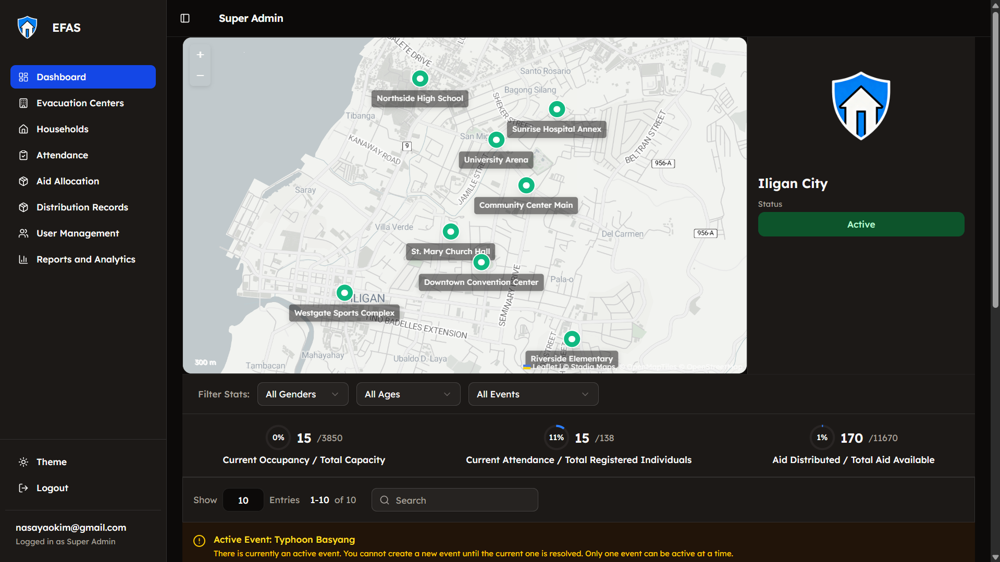
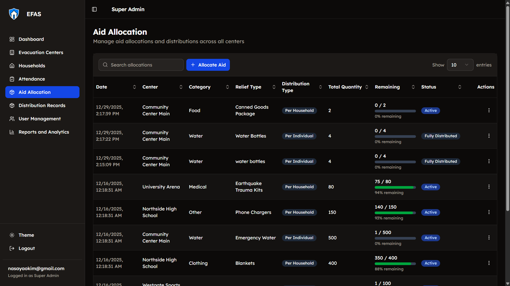

# Application Name

A web-based disaster management platform that enables local government units to coordinate evacuation centers, track households and attendance, and manage aid distribution during emergency events.

---

## Showcase

### Evacuation Facility Management

### Resource Allocation

---

## Features

* **Evacuation Center Management** – Create, update, and monitor multiple evacuation centers across a city with centralized oversight.
* **Role-Based Access Control (RBAC)** – Secure multi-user workflows for City Admins, Center Admins, and Volunteers using JWT authentication.
* **Household Registration & Attendance Tracking** – Register households and track real-time attendance during disaster events for accurate occupancy monitoring.
* **Aid Allocation & Distribution** – Allocate resources to evacuation centers and track distribution to households with full visibility and accountability.
* **Real-Time Dashboards & Analytics** – Monitor occupancy, resource usage, and event statistics through centralized dashboards for data-driven decision-making.
---

## Technologies Used

* Flask
* PostgreSQL
* React
* Docker
* Stadia Maps

