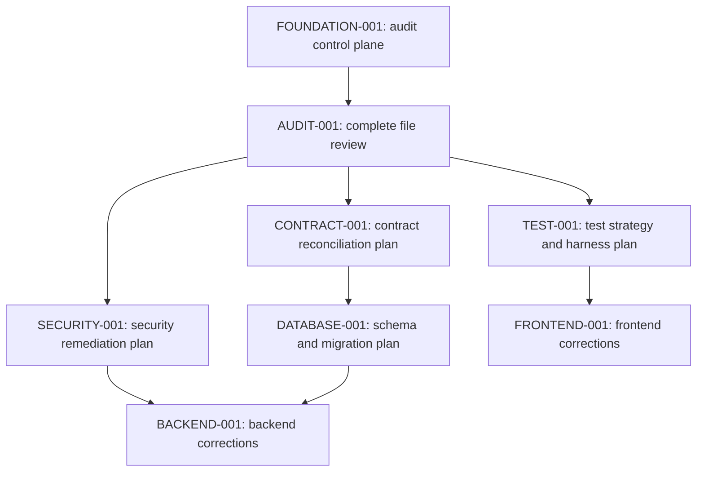

# EFAS Master Overhaul Plan

> Status: audit bootstrap in progress. This document is the authoritative execution plan and must be refined from repository evidence before feature-modification tickets begin.

## Executive summary

EFAS is a Flask/PostgreSQL backend with a React/Vite frontend. The baseline shows reproducible locked dependency installation, but no committed tests, CI workflows, containers, infrastructure definitions, or Flask migrations. Formatting and lint checks fail substantially, the production WSGI entry point is absent, and security-sensitive defaults require review.

The first phase is a complete, evidence-led audit. It will account for every tracked file, characterize feature behavior and contracts, then create independently reviewable implementation tickets. No architectural rewrite is presumed.

## Current stack and topology

- `backend/`: Flask 3.1, SQLAlchemy, Marshmallow, Flask-JWT-Extended, Flask-Migrate, PostgreSQL-oriented raw SQL and ORM models.
- `frontend/`: React 19, TypeScript 5.9, Vite 7, Zustand, Zod, Axios, Radix/shadcn, Tailwind.
- Runtime entry points: `backend/run.py` for development; `backend/wsgi.py` is empty although the Pipenv production script invokes `wsgi:app`.
- User roles: `super_admin`, `city_admin`, `center_admin`, and `volunteer`.

## Baseline evidence

| Command or check | Result |
| --- | --- |
| `pipenv verify` and `pipenv sync --dev` | Passed; lockfile current |
| `npm ci` | Passed; 20 dependency advisories reported |
| frontend `format:check` | Failed: 162 files |
| frontend `lint` | Failed: 909 errors, 168 warnings |
| frontend `type-check` | Passed |
| frontend `build` | Passed; large-chunk warning |
| backend Flake8 | Failed: 1,211 findings in 35 files |
| backend Black check | Failed: 30 files |
| backend isort check | Failed: 32 files |
| Flask application import | Passed; 84 routes registered |
| WSGI assertion | Failed: `wsgi.py` does not expose `app` |
| tests / CI / migrations / containers | No configured artifacts found |

Full command context belongs in `evidence/BASELINE.md` as the audit proceeds.

## Audit methodology and target invariants

Audit all relevant human-authored source and configuration files. Establish intended behavior from documentation, public contracts, tests, database constraints, observed behavior, consistent patterns, history, then conservative judgment—in that order. Record conflicts rather than guessing.

The finished plan must define one evidence-backed convention for contracts, validation, errors, identifiers, time handling, transactions, pagination, authorization, dependencies, imports, tests, and development workflows. Intentional feature differences remain intact.

## Ordered roadmap

`FOUNDATION-001`, `AUDIT-001`, and `AUDIT-002` are complete. The remaining IDs are planning placeholders; they become implementation tickets only after the audit produces bounded scopes, tests, and compatibility analysis.

## FOUNDATION-001 — Establish audit control plane and baseline

- **Priority/risk:** P1 foundation; documentation-only, reversible.
- **Motivation/evidence:** The requested `docs/overhaul/` control artifacts were absent, leaving no authoritative source for ticket execution. The baseline above was obtained from the clean `main` worktree.
- **Scope:** Create and maintain the master plan, coverage ledger, findings register, feature/test matrix, progress ledger, architecture summary, agentic-readiness checklist, and proposed instructions. Capture baseline evidence without secrets.
- **Non-goals:** Do not modify application code, lockfiles, database schemas, runtime configuration, or dependencies.
- **Dependencies:** None.
- **Likely files:** `docs/overhaul/**` only.
- **Current behavior:** No repository-local overhaul documentation exists.
- **Intended invariant:** Each future ticket is traceable to evidence, has bounded scope and validation, and never obscures existing user work.
- **Checklist:** inventory every tracked file; classify ignored/generated groups; document baseline commands; trace architecture and features; register findings; generate implementation tickets and dependency graph; update progress after each ticket.
- **Required tests/validation:** ledger totals reconcile with Git; links and IDs resolve; no secrets in artifacts; `git diff --check`; review confirms docs-only diff.
- **Security/database/compatibility:** do not expose `.env` values or run mutable database commands; no runtime changes.
- **Rollback:** remove only the newly added documentation files if the audit is abandoned.
- **Acceptance criteria:** all required control artifacts exist, accurately reflect the snapshot, and explicitly label unreveiwed areas.
- **Review checklist:** evidence is cited; no completion claim exceeds review state; existing documentation is not duplicated without need.
- **Escalation:** none unless repository evidence requires destructive data work, a public-contract change, or external credentials.
- **Estimated size:** M.

## AUDIT-001 — Review repository instructions, documentation, manifests, and build tooling

- **Priority/risk:** P1 audit prerequisite; documentation-only, reversible.
- **Motivation/evidence:** The baseline found conflicting workflow evidence (`main` snapshot versus `dev` contribution target), a Docker documentation claim without container files, unconstrained Pipfile dependency declarations, mutable install scripts, and no test command.
- **Scope:** Complete audit batch 0: every root file, existing `docs/**` source, backend/frontend manifests and lockfiles, Git ignore rules, build scripts, formatter/linter/type configurations, and available local Git history.
- **Non-goals:** Do not format application code, update dependencies, alter lockfiles, add CI, or fix source behavior.
- **Dependencies:** FOUNDATION-001.
- **Likely files:** root `README.md`, `BUILD.md`, `CONTRIBUTING.md`, build scripts and ignore rules; `docs/**`; `backend/Pipfile*`; `frontend/package*.json`, TypeScript/Vite/ESLint/Prettier/Husky configuration.
- **Current behavior:** Setup is reproducible only with explicit local runtime paths; test/CI/container configuration is absent; formatting and lint checks fail.
- **Intended invariant:** Every operational claim has an implementation/configuration counterpart or an explicit finding; each reviewed file has a ledger row and evidence-backed classification.
- **Checklist:** inspect every assigned file; compare documentation claims to manifests and scripts; trace install/build outputs; examine lockfile/runtime compatibility; inspect hooks and validation commands; examine history only as behavioral evidence; update coverage, findings, architecture, and readiness documents.
- **Required tests:** none; this ticket characterizes current state only.
- **Required validation:** `git diff --check`; ledger accounting; verify no secrets are copied; rerun only read-only manifest/config extraction as needed.
- **Security/database/compatibility:** inventory environment variable names only; do not contact services or invoke database setup/seed scripts.
- **Rollback:** remove only documentation additions for this ticket.
- **Acceptance criteria:** every batch-0 file is marked reviewed or validly excluded; contradictions and missing operational controls are findings; no unsubstantiated behavior claim remains.
- **Review checklist:** documentation statements cite their source path; lockfile findings distinguish current lock contents from upgrade recommendations; no application files changed.
- **Escalation:** ask only if a required external system or policy is necessary to resolve a material workflow conflict.
- **Estimated size:** M.

## AUDIT-002 — Review backend bootstrap, configuration, authentication, and user administration

- **Priority/risk:** P1 security and runtime audit prerequisite; documentation-only, reversible.
- **Motivation/evidence:** Confirmed configuration defaults weaken production safety, the login flow returns a JWT in both JSON and a cookie, and the WSGI production entry point is missing. Authorization behavior cannot be safely standardized without tracing every relevant route and service.
- **Scope:** Review `backend/run.py`, `backend/wsgi.py`, `backend/app/__init__.py`, `config.py`, model extension setup, auth/user routes, auth/user schemas and services, the user model, and adjacent validation helpers.
- **Non-goals:** Do not change authentication, session behavior, user roles, secrets, or database data.
- **Dependencies:** AUDIT-001.
- **Likely files/modules:** backend bootstrap and the auth/user portions of `app/models`, `app/routes`, `app/schemas`, `app/services`, and `app/utils`.
- **Current behavior:** JWT supports headers and cookies; login returns and sets a token; endpoint-level authorization varies by feature; production WSGI target fails.
- **Intended invariant:** Authentication, authorization, identity, session, error, and user-management behavior is documented from implementation and cross-checked against frontend contracts before remediation is planned.
- **Checklist:** inspect all assigned files; enumerate endpoints/decorators/role checks; trace login/register/logout/current-user/user CRUD; inspect user constraints and transactions; compare request/response schemas with route behavior; examine exception/logging/secret behavior; update all audit artifacts.
- **Required tests:** none added in this audit ticket; identify the exact unit, API, authorization, and regression tests required for subsequent fixes.
- **Required validation:** static route map; Flask import smoke; WSGI assertion; `git diff --check`; ledger accounting.
- **Security/database/compatibility:** do not run against a live database or mutate accounts; never record token or secret values; flag any material authentication/privacy behavior change for user escalation.
- **Rollback:** remove only audit documentation changes.
- **Acceptance criteria:** every assigned file is ledgered; every authentication/user flow has an evidence-backed map; confirmed defects and ambiguities are registered; required remediation tickets are bounded.
- **Review checklist:** distinguish frontend UI gating from backend enforcement; distinguish config intent from effective values; cite exact routes and symbols.
- **Escalation:** any fix that changes token transport, cookie scope, session duration, role/tenant semantics, user data retention, or public API behavior.
- **Estimated size:** M.

### AUDIT-002 completion evidence

Reviewed 15 files listed in `FILE_COVERAGE.md`. The effective configuration is unsafe outside local development: fallback secrets are present, debug is always enabled, the configured expiry environment value is overwritten, and cookie CSRF is off. `POST /api/auth/login` emits the JWT in both JSON and an HTTP-only cookie but hard-codes an insecure cookie setting. Most urgently, all generic `/api/users/**` endpoints authenticate but do not authorize the caller; their services do not receive a caller either. This is a confirmed P1 server-side authorization bypass, not merely an absent UI restriction. No production data or account operation was performed.

The intended actor/role/tenant policy still needs frontend and domain evidence before a behavior-changing remediation ticket can be approved. Required future regression coverage: unauthenticated `401`; each role’s allowed/denied CRUD, lifecycle, and privilege-change cases; self-targeting restrictions; role/center invariant transitions; header/cookie/CSRF behavior; invalid/expired token; persistence rollback; and response-schema non-disclosure of password hashes.

## AUDIT-003 — Review database setup, schema, seed data, migrations, and persistence model boundaries

- **Priority/risk:** P1 audit prerequisite; documentation-only, reversible.
- **Motivation/evidence:** The project uses PostgreSQL-oriented raw SQL and Flask-Migrate but has no tracked migration directory. User writes commit inside model methods, and database behavior must be characterized before remediation or testing can safely use a disposable database.
- **Scope:** Review all tracked database SQL, setup/seed scripts, and data fixtures. Domain-model implementation is reviewed with its owning feature flows in later audit tickets; reconcile the schema against the already reviewed user model now and against remaining models when those tickets run.
- **Non-goals:** Do not create a database, run setup/seed/reset scripts, execute migrations, alter schema, or change persisted data.
- **Dependencies:** AUDIT-002.
- **Likely files/modules:** `backend/database/**`, the already reviewed user persistence code, and database references in scripts/docs.
- **Current behavior:** The configured default is SQLite but user SQL uses PostgreSQL features (`ILIKE`, `RETURNING`, `NOW()`); no tracked migration chain establishes supported upgrade history.
- **Intended invariant:** Every table, relationship, identifier, time field, seed path, and write transaction has a documented source and clear database-engine compatibility status.
- **Checklist:** inventory all database artifacts; inspect SQL ordering/constraints/indexes/defaults/cascades; map every model/table; identify schema-versus-model drift; classify migration/seed/recovery safety; record SQL dialect assumptions; update the ledger, architecture map, matrix, and findings.
- **Required tests:** none added while auditing; specify clean-create, supported-upgrade, seed, constraint, rollback, and transaction tests needed for remediation.
- **Required validation:** read-only file inventory and schema extraction; no database command; `git diff --check`; accounting reconciliation.
- **Security/database/compatibility:** do not inspect local database contents or connection values; mark destructive or irreversible data migration candidates for escalation.
- **Rollback:** remove only audit documentation changes.
- **Acceptance criteria:** every assigned database artifact is reviewed or validly excluded; schema, reviewed-model, and runtime dialect conflicts are findings; no database operation occurs.
- **Review checklist:** distinguish confirmed SQL behavior from undocumented product intent; cite table and symbol names; do not mistake untracked local data for repository evidence.
- **Escalation:** only if repository evidence requires a destructive data migration, policy interpretation, or an external database credential.
- **Estimated size:** M.

### AUDIT-003 completion evidence

Reviewed all five tracked database artifacts. The source of truth is a monolithic PostgreSQL script containing constraints, trigger functions, reporting views, indexes, and seed categories; it is not a Flask-Migrate history. Its `IF NOT EXISTS` table clauses do not make the later named constraints/triggers idempotent. The runner performs no clean create/upgrade/recovery verification and only treats duplicate-table failures specially. The application’s default SQLite URI cannot run this PostgreSQL/PostGIS-specific system. The seed runner permits partial commits and assumes fresh serial IDs. No database connection, setup, seed, reset, or migration command was executed.

Required future coverage includes: clean PostgreSQL/PostGIS bootstrap; each supported upgrade path; migration downgrade/rollback where supported; constraints/triggers/views; seed idempotence and fixture isolation; transaction rollback; backup/restore drill; and a cross-dialect policy test that rejects unsupported runtime configuration early.

## AUDIT-004 — Review evacuation-center and event feature flows

- **Priority/risk:** P1 audit prerequisite; documentation-only, reversible.
- **Motivation/evidence:** Centers and events own capacity, status, geographic coordinates, and active-event constraints. Schema triggers and model code both implement lifecycle behavior, creating potential duplicate or contradictory enforcement.
- **Scope:** Review the backend center/event/stats models, schemas, services, routes, and direct database interactions; trace creation, update, assignment, resolution, map queries, deletion, capacity, and event-center associations. Matching frontend code is reviewed in the dedicated frontend batches.
- **Non-goals:** Do not change center/event data, spatial settings, roles, schema, or runtime behavior.
- **Dependencies:** AUDIT-003.
- **Likely files/modules:** `backend/app/{models,schemas,services,routes}/{evacuation_center,event}*` and relevant backend stats/map code.
- **Current behavior:** Raw SQL models mutate input dictionaries, commit internally, use PostgreSQL/PostGIS expressions, and duplicate database-trigger lifecycle rules; frontend behavior remains to be inspected.
- **Intended invariant:** A center/event change is authorized, validates its contract once, preserves schema invariants, updates relationships/derived capacity atomically, and returns stable contracts.
- **Checklist:** complete file review; map lifecycle state transitions and trigger interactions; compare model/schema/API/frontend contracts; inspect authorization and all delete/reassign paths; identify transaction and geospatial compatibility risks; update matrices/findings/ledger; define bounded remediation tests.
- **Required tests:** none added in this audit ticket; specify API authorization/validation tests, PostGIS integration tests, active-event concurrency tests, lifecycle/delete rollback tests, and map-contract tests.
- **Required validation:** read-only inventory and static route/model mapping; no database mutation; `git diff --check`; ledger accounting.
- **Security/database/compatibility:** do not query local data; treat spatial extension enablement, destructive center deletion, and behavior-changing role/retention policy as escalation points.
- **Rollback:** remove only audit documentation changes.
- **Acceptance criteria:** all assigned files are ledgered, flows are evidence-backed across currently reachable layers, and every confirmed defect/ambiguity has a finding or decision record.
- **Review checklist:** do not infer an event/center policy from labels alone; distinguish trigger-enforced from service-enforced behavior.
- **Escalation:** a change that alters public lifecycle states, spatial data storage, center deletion/reassignment, or downtime requirements.
- **Estimated size:** M.

### AUDIT-004 completion evidence

Reviewed 12 backend center/event/stats files. Event writes, event-center association writes, center updates, triggers, and auto-checkout work are not one atomic unit. The center route is a P1 authorization boundary failure: it provides no role or scope enforcement beyond JWT validity. Event mutations enforce `super_admin`, but its route-level active-event precheck is more restrictive than the model’s documented rule, and route/service/schema response assembly drifts. Center spatial storage is contradictory (`POINT` in raw schema, `Geometry` in ORM, PostGIS functions in queries) and photo persistence accepts arbitrary base64 data. No center, event, map, photo, or database operation was executed.

Required future coverage includes: each role’s center/event read/write matrix; active-event race/concurrency; transaction rollback across event/center/attendance state; trigger and route interoperability; PostGIS coordinate serialization/query tests; upload-content limits and safe response policy; destructive center-delete approval/rollback; and all stats filter/contract combinations.

## AUDIT-005 — Review household and individual feature flows

- **Priority/risk:** P1 audit prerequisite; documentation-only, reversible.
- **Motivation/evidence:** Households/individuals contain personally identifying information and are connected to attendance, allocation, and occupancy. Their current routes rely only on JWT authentication.
- **Scope:** Review the backend household/individual models, schemas, services, and routes; trace create/update/delete, household-head, center filtering, status summaries, search, and recalculation.
- **Non-goals:** Do not change records, recalculate status, or alter PII retention/role policy.
- **Dependencies:** AUDIT-004.
- **Likely files/modules:** `backend/app/{models,schemas,services,routes}/{household,individual}*`.
- **Current behavior:** Generic CRUD and status functions expose or mutate data for every authenticated account; validation and pagination contracts disagree across layers.
- **Intended invariant:** Identity and center ownership are enforced server-side; contracts validate each route’s declared data; household/head/individual relationships remain consistent; count and result sets use identical filters.
- **Checklist:** inspect every assigned file; map PII reads/writes and relationship ownership; compare all schemas to routes/models; identify transaction boundaries and destructive cascades; record required role, validation, pagination, and regression tests.
- **Required tests:** none added in audit; specify authorization matrix, validation, cross-center, partial-update, pagination, relation/head, transaction-rollback, and status-recalculation tests.
- **Required validation:** static route/model/contract mapping; no database mutation; `git diff --check`; ledger accounting.
- **Security/database/compatibility:** protect PII; escalation is required before a policy changes user access to personal records or data retention.
- **Rollback:** remove only audit documentation changes.
- **Acceptance criteria:** every assigned file is ledgered and confirmed behavior/drift is recorded without altering application data.
- **Review checklist:** distinguish frontend visibility from backend enforcement; preserve data ownership evidence.
- **Escalation:** any retention, deletion, cross-center-sharing, or access-policy change.
- **Estimated size:** M.

### AUDIT-005 completion evidence

Reviewed eight household/individual backend files, plus their already reviewed persistence models. Every route is authentication-only, including global status recalculation. The standalone individual create and update schemas disagree with their documented endpoint contracts, while household schemas are bypassed. Result and count queries disagree on center scope; fields and age categories are inconsistent between feature and dashboard outputs. No individual, household, status, or database mutation was performed.

Required future coverage includes role/center PII access tests; all mutation and relation invariants; standalone and nested creation; partial update; bulk delete rollback; recalculation authorization/idempotence; pagination equality; and date/age boundary tests using a fixed clock.

## AUDIT-006 — Review attendance and transfer feature flows

- **Priority/risk:** P1 audit prerequisite; documentation-only and reversible.
- **Motivation/evidence:** Attendance changes individual status, event occupancy, and center capacity, so record identity, audit attribution, authorization, and transaction boundaries are integrity-critical. The discovered singleton checkout defect can target the wrong logical identifier.
- **Scope:** Review all backend attendance/transfer models, services, routes, and available schemas; trace individual and batch check-in/checkout, transfer, histories, event/center queries, status/occupancy effects, and role/center filters.
- **Non-goals:** Do not check in, check out, transfer, recalculate, or alter any attendance, event, center, or individual data. Do not define an unproven batch atomicity product policy.
- **Dependencies:** AUDIT-005.
- **Likely files/modules:** `backend/app/{models,services,routes}/attendance_records.py` and database trigger evidence already reviewed in `backend/database/sql/create_tables.sql`.
- **Current behavior:** The route receives a record ID, but singleton checkout uses it as an individual ID. Transfers and automatic transfers comprise independently committed writes; batch endpoints can leave partial success. Several reads are scoped, while individual history and recorder identity lack equivalent ownership controls.
- **Intended invariant:** Every attendance mutation uses one unambiguous record/individual contract; only the server-derived actor may be recorded; authorization is consistently role/center scoped; event/center/individual/occupancy changes are atomic or explicitly compensated; all timestamps and response shapes follow a canonical contract.
- **Checklist:** inspect each assigned file; map every endpoint/decorator/role branch; reconcile model/service/database trigger duties; trace failure and concurrency paths; compare result/detail/batch contracts; record exact remediation tests and any decision point.
- **Required tests:** API regression for record-ID checkout; authorization matrix and cross-center history denial; server-owned recorder attribution; active-record concurrency; check-in/transfer/checkout rollback; batch atomicity or declared partial-result semantics; trigger/model consistency; UTC/serialization and list/detail contract tests.
- **Required validation:** static endpoint/model mapping, ledger reconciliation, `git diff --check`; no database mutation in this audit ticket.
- **Security/database/compatibility:** attendance history is PII and transfers affect capacity. A change to cross-center sharing, retention, batch semantics, or irreversible attendance repair requires escalation.
- **Rollback:** remove only documentation artifacts.
- **Acceptance criteria:** all assigned files are ledgered; confirmed identity, authorization, transaction, contract, and lifecycle defects are registered; no production behavior changes occur.
- **Review checklist:** distinguish record identifiers from person identifiers; distinguish database-enforced triggers from application logic; do not infer whether partial batches are intentional without product evidence.
- **Escalation:** choose only when a compatible policy cannot be inferred for batch atomicity, transfer visibility, PII sharing, or historical repair.
- **Estimated size:** M.

### AUDIT-006 completion evidence

Reviewed the three tracked attendance files; no attendance schema module exists. `PUT /api/attendance/<record_id>/check-out` first resolves a record, then its service and model interpret that same value as an individual ID, producing a confirmed P1 checkout failure whenever those identifiers differ. Transfer and automatic-transfer flows split related writes into independently committed operations; batches commit item-by-item and may return partial success. Individual attendance history is authentication-only, and clients can supply `recorded_by_user_id`. The flow mixes route validation, raw timestamp strings, naive local timestamps, trigger-managed status/occupancy, and application-side lifecycle work. No attendance, transfer, or database mutation was performed.

## AUDIT-007 — Review aid allocation and distribution feature flows

- **Priority/risk:** P1 audit prerequisite; documentation-only and reversible.
- **Motivation/evidence:** Allocations and distributions control scarce aid quantities, recipient identity, inventory state, and potentially destructive corrections. The currently reviewed docs show a separate allocation UI, but backend behavior and invariants remain unverified.
- **Scope:** Review all allocation/distribution backend models, schemas, services, routes, helper utilities, and their direct database dependencies; trace category allocation, distribution, reversal/correction where present, totals, filtering, pagination, role/center scope, and error handling.
- **Non-goals:** Do not create, distribute, modify, reverse, or delete aid records; do not choose stock ownership or correction policy without evidence.
- **Dependencies:** AUDIT-006.
- **Likely files/modules:** `backend/app/{models,schemas,services,routes}/{aid_allocation,distribution}*` and directly referenced category/inventory code.
- **Current behavior:** Unknown until complete file inspection; no behavior is assumed from the UI screenshot or module names.
- **Intended invariant:** An authorized actor can only allocate/distribute stock they own or are scoped to; remaining amounts never go negative; recipient, allocation, event, and center links are valid; concurrent or retried writes cannot double-distribute; contracts, pagination, and audit data are stable.
- **Checklist:** inventory and inspect each assigned file; enumerate endpoint permissions; map data ownership and stock arithmetic; trace every write/commit/rollback path; compare schemas, routes, services, models, and SQL; record feature/test matrix and findings with exact evidence.
- **Required tests:** to be specified from evidence, including role/center authorization, input validation, insufficient-stock, duplicate/retry/concurrency, transaction rollback, quantity arithmetic, pagination/filter equality, correction policy, and response-contract tests.
- **Required validation:** read-only static mapping, ledger reconciliation, `git diff --check`; do not run data-mutating routes or database setup during audit.
- **Security/database/compatibility:** aid history may expose household/individual data and controls scarce resources; any stock correction, destructive reversal, retention, or cross-center policy change is an escalation point.
- **Rollback:** remove only documentation artifacts.
- **Acceptance criteria:** each assigned source/configuration file is ledgered and every confirmed defect/ambiguity has an evidence-backed finding or decision package.
- **Review checklist:** do not confuse displayed quantity with persisted/available quantity; distinguish intentional partial distribution from unhandled failure.
- **Escalation:** incompatible inventory ownership, destructive correction, or public distribution-contract decisions.
- **Estimated size:** M.

### AUDIT-007 completion evidence

Reviewed seven backend allocation/distribution files, reconciling them with the already reviewed schema. Distribution creation is JWT-only, creates a session with hard-coded event ID 1, and commits that session and every item separately. It bypasses the database functions that enforce active center/event/allocation checks and does not establish household/allocation center or event ownership. The status toggle has no actor check and can alter stock for any authenticated caller. Allocation update interpolates arbitrary JSON keys into SQL despite claiming to use a whitelist. Distribution update/status operations combine manual quantity changes with independently committing models. No allocation, distribution, inventory, or database mutation was performed.

## AUDIT-008 — Review frontend shell, routing, shared UI, authentication, and styles

- **Priority/risk:** P1 audit prerequisite; documentation-only and reversible.
- **Motivation/evidence:** Backend security conclusions must be reconciled with actual frontend requests, route protection, token transport, data-fetching behavior, and UI states. The frontend baseline type-check/build pass but formatting and lint gates fail broadly.
- **Scope:** Review frontend application entry points, router/layout/protection, global styles, shared UI components, authentication state/client integration, shared query primitives, type/configuration utilities, and assets used by the shell. Feature-specific role pages remain for AUDIT-009.
- **Non-goals:** Do not restyle components, alter product workflows, reformat source, change token transport, or update dependencies.
- **Dependencies:** AUDIT-007.
- **Likely files/modules:** `frontend/src/{main,App}.tsx`, routing/layout/auth infrastructure, global CSS, `components/ui/**`, shared components, `services` and `stores` used by bootstrap/auth, shared hooks/types/utils, and public/static shell assets.
- **Current behavior:** Unverified until inspection; existing type-check and production build pass, while formatting/lint failures are baseline findings.
- **Intended invariant:** Route access, user identity, API transport, error/loading/empty states, global styling, imports, and shared components have evidence-backed ownership; frontend gating is explicitly distinguished from backend enforcement.
- **Checklist:** inventory deterministic frontend shell batch; inspect route tree and provider order; trace login/logout/session restoration/API interceptors; map protected role handling and redirect behavior; inspect shared UI/accessibility/error boundaries/styles; compare frontend contracts to reviewed APIs; log all findings and required tests.
- **Required tests:** specify component/route/auth/client tests from evidence, including token/session behavior, role redirects, API errors, loading/empty states, accessibility, and contract serialization.
- **Required validation:** read-only source mapping, `git diff --check`, ledger reconciliation; reuse baseline type/build results but do not reinterpret them as behavior coverage.
- **Security/database/compatibility:** do not expose frontend environment values or invoke live API calls; frontend-only visibility cannot remedy server authorization failures.
- **Rollback:** remove only documentation artifacts.
- **Acceptance criteria:** every assigned frontend shell file is ledgered; identity/route/client behaviors and cross-layer conflicts have concrete evidence; no implementation changes occur.
- **Review checklist:** distinguish generated/shadcn code from locally owned modifications; preserve intentional visual variants; verify route protection against direct navigation rather than UI links alone.
- **Escalation:** only for a material token/session/privacy/public-route policy choice not resolvable from evidence.
- **Estimated size:** M.

### AUDIT-008 completion evidence

Reviewed 54 frontend shell/auth/shared files, including a coherent 24-file shadcn/Radix-derived component-source group validly excluded from line-by-line feature inspection after reviewing its configuration, exports, representative primitives, and domain-marker scan. The user/role flag is persisted but never hydrated from `/auth/me` before the client route gate renders. Axios sends credentials and holds the JSON login token in memory but also tries to read an HTTP-only cookie through `document.cookie`. Route groups and sidebar navigation give different role access signals; type consumers mix snake_case API properties with camelCase center properties. Shared table and layout components have accessibility/responsive faults, and empty/unused mock/layout/hook files remain. No browser or API action was executed.

## AUDIT-009 — Review remaining frontend feature flows and contract clients

- **Priority/risk:** P1 audit prerequisite; documentation-only and reversible.
- **Motivation/evidence:** The remaining 121 tracked frontend files contain the actual screens, forms, modals, feature stores, API clients, types, validation schemas, maps, and duplicate V1/V2 flows that determine the user-visible behavior of every reviewed backend feature.
- **Scope:** Review all remaining frontend source and public feature assets in deterministic sub-batches: role pages/dashboards; feature components for centers/events/households/individuals/attendance/transfers/allocations/distributions; map components/styles; all non-auth API services/stores; remaining schemas/types/utilities; sample pages. Trace each UI action to its service, route, contract, loading/error/empty/success state, permission gate, and existing backend evidence.
- **Non-goals:** Do not call live APIs, create data, change UI behavior, remove V1/V2 code, restyle pages, or decide product policy from naming alone.
- **Dependencies:** AUDIT-008.
- **Likely files/modules:** all remaining `frontend/src/**` files not ledgered in AUDIT-008, grouped by feature and role.
- **Current behavior:** Unknown until complete source inspection. Existing route imports favor V2 attendance pages, while V1 pages/components remain tracked; the intended rollout/migration status requires evidence.
- **Intended invariant:** Every frontend feature has a documented entry point, client/service/store/type/schema owner, backend contract, expected UI states, role/center scope, and regression test need. Intentional V1/V2 differences are distinguished from unreachable duplication.
- **Checklist:** build exact remaining-file batches; inspect every assigned file; map request/response shapes to reviewed APIs; identify unsupported endpoints and stale/duplicate components; inspect accessibility and state ownership; update matrix/findings/architecture/ledger after each batch; never mark uninspected feature code complete.
- **Required tests:** specify component, store, API-client/mock-server, accessibility, route, and critical journey tests per discovered feature; include regressions for every confirmed mismatch.
- **Required validation:** source mapping and ledger reconciliation per sub-batch; `git diff --check`; no network/live-data command. Preserve baseline lint/type/build evidence separately.
- **Security/database/compatibility:** never confuse client visibility with server authorization; flag any UI evidence that would require a backward-incompatible public contract, data correction, or retention/access policy decision.
- **Rollback:** remove only documentation artifacts.
- **Acceptance criteria:** all 121 remaining files are reviewed or validly excluded, feature matrix rows are evidence-backed, and P0-P3 findings are registered with test requirements.
- **Review checklist:** compare each service path/method/payload to the Flask route; inspect direct navigation and refresh behavior; test claims must be based on actual existing test artifacts, not source comments.
- **Escalation:** only material contract, feature-retirement, cross-role privacy, or data-repair decisions unresolved by repository evidence.
- **Estimated size:** must-split into deterministic feature batches.

## Execution loop

For every future ticket: read this plan, `PROGRESS.md`, `FINDINGS.md`, `FILE_COVERAGE.md`, applicable instructions, and Git status; select the highest-priority unblocked ticket; implement only its scope; add required tests; run narrow then complete validation; review the complete diff; record P0-P4 findings; fix all P0-P3 findings before publication; update artifacts; publish only when credentials, CI, and repository policy permit.

## Definition of done

Completion requires complete ledger coverage, documented behavior for every feature, no unresolved P0-P3 findings, passing required validation suites, verified clean/upgrade database migrations, reproducible setup, secure dependency posture, CI coverage, accurate documentation, and a final system review. The later `/goal` stops only when those criteria are evidenced.

## Implementation roadmap

The audit tickets are complete. The tickets below are the authoritative implementation backlog. They are ordered by safety; each remains blocked when its listed decision point is unresolved. No broad rewrite is authorized.

| ID | Priority | Scope and invariant | Dependencies | Size |
| --- | --- | --- | --- | --- |
| DEVOPS-001 | P1 | Export the Flask application from `backend/wsgi.py`; the documented Gunicorn target must import without debug-only behavior. Add an import smoke regression. | none | XS |
| TEST-001 | P1 | Establish isolated backend API/unit test infrastructure and frontend component/client test infrastructure with deterministic fixtures; do not weaken existing checks. Completed by TEST-001A/B/C; database integration is separately deferred to TEST-002 after DATABASE-002. | DEVOPS-001 | must-split |
| TEST-002 | P1 | Establish disposable PostgreSQL/PostGIS integration fixtures, clean/upgrade migration validation, and transaction isolation after DATABASE-002 defines the supported migration baseline. | DATABASE-002 | must-split |
| SECURITY-002 | P1 | Centralize actor resolution and server-side role/center authorization for `/users/**`; deny cross-role and privilege-escalating writes. | TEST-001 | M |
| SECURITY-004 | P1 | Apply the same server-side authorization policy to center reads and mutations, including map/status/photo paths. | SECURITY-002 | M |
| SECURITY-006 | P1 | Apply PII/center-scope authorization to household and individual reads, writes, search, and status recalculation. | SECURITY-002 | M |
| SECURITY-007 | P1 | Scope attendance histories and derive recorder identity from the JWT; reject caller-supplied audit attribution. | SECURITY-006, TEST-001 | M |
| SECURITY-008 | P1 | Enforce distribution actor, center, event, household, and allocation ownership before any inventory mutation. | SECURITY-006, TEST-001 | M |
| SECURITY-009 | P1 | Replace dynamic allocation SQL identifiers with an explicit field whitelist and server-owned quantity derivation. | TEST-001 | S |
| SECURITY-010 | P1 | Render map marker content without HTML interpolation; test hostile center names. | TEST-001 | S |
| DATABASE-002 | P1 | Adopt a versioned PostgreSQL/PostGIS migration baseline and document supported upgrade/rollback states. | decision: migration baseline and recovery approval | must-split |
| DATABASE-003 | P1 | Make PostgreSQL/PostGIS the explicit supported runtime and fail fast for unsupported SQLite configuration. | DATABASE-002 | M |
| ATTENDANCE-001 | P1 | Make checkout/transfer APIs unambiguously operate on attendance-record IDs; fix all routed V2 callers. | SECURITY-007, TEST-001 | M |
| ATTENDANCE-002 | P1 | Make attendance/transfer writes transactional and define tested batch rollback/partial-result semantics. | DATABASE-002, decision: batch semantics | must-split |
| DISTRIBUTION-001 | P1 | Make distribution session/item/stock writes atomic and stop hard-coding event 1; define historical repair separately. | DATABASE-002, SECURITY-008, decision: inventory repair | must-split |
| DEPENDENCY-001 | P1 | Triage npm advisories, patch safe dependencies, and isolate breaking upgrades for approval. | TEST-001 | M |
| SECURITY-001/003 | P1/P2 | Remove insecure secrets/debug defaults and select one compatible token/cookie/CSRF transport. | decision: authentication behavior | M |
| BACKEND-002/003/004/005/006/007 | P2 | Correct bounded lifecycle, transaction, query, and duplicate-service defects after authoritative contracts and migrations exist. | related P1 tickets | must-split |
| CONTRACT-001..006, FRONTEND-001..018 | P2/P3 | Reconcile contracts and client behavior feature by feature with regression tests; retire unreachable legacy code only after route/behavior confirmation. | corresponding backend/security ticket | must-split |
| QUALITY-001/002, DEVOPS-002..005, AGENT-001 | P2 | Restore quality gates, CI/local setup, runtime pinning, hooks, instructions, and agent safeguards after tests are reliable. | TEST-001 | must-split |

### DEVOPS-001 — Restore the production WSGI entry point

- **Priority/risk:** P1 / XS; production start failure, reversible source change.
- **Evidence:** `backend/Pipfile` invokes Gunicorn with `wsgi:app`; `backend/wsgi.py` is empty and the recorded import assertion fails.
- **Scope:** create only the module-level application factory export and a focused import test/smoke check. Likely files: `backend/wsgi.py`, new backend test bootstrap only if TEST-001 is not needed for this import assertion.
- **Non-goals:** no configuration, authentication, database, routing, dependency, or deployment policy change.
- **Invariant/current behavior:** `from wsgi import app` must succeed and expose the same factory-created Flask application; it currently raises/no-exports.
- **Checklist:** inspect the factory contract; add `app = create_app()` using existing configuration behavior; verify route count/import without a database; record the exact validation result.
- **Tests/validation:** `py -3.13 -m pipenv run python -c "from wsgi import app; assert app"`; existing Flask import smoke; backend format/import checks limited to changed files; `git diff --check`.
- **Security/database/compatibility:** no secrets or database connection values; no schema migration; preserve existing Flask configuration loading.
- **Rollback:** revert `backend/wsgi.py` and its focused test only.
- **Acceptance/review:** documented Gunicorn target imports; no new application behavior; changed diff is limited to this scope; no P0-P3 issue in review.
- **Escalation:** only if the application factory cannot create safely without an external production configuration (not currently evidenced).

### TEST-001A — Establish the dependency-free backend regression command

- **Priority/risk:** P1 / S; first required split of TEST-001, with no database or external service access.
- **Evidence:** no test command or files existed; DEVOPS-001 was only covered by an ad-hoc import command.
- **Scope:** add a Pipenv `test` script and stdlib `unittest` discovery; add a WSGI regression that verifies the documented `wsgi:app` export and a representative registered API route.
- **Non-goals:** no test framework dependency, database fixture, route behavior test, production configuration change, or frontend test setup.
- **Dependencies:** DEVOPS-001.
- **Validation:** `py -3.13 -m pipenv run test`, Black/isort on changed Python files, `pipenv verify`, and `git diff --check`.
- **Acceptance/rollback:** test command completes without live database access and fails if the WSGI export/route registration regresses; revert only the `Pipfile` script and `backend/tests/**` files to roll back.
- **Escalation:** none; database-backed test infrastructure is deferred to a separate TEST-001 split after DATABASE-002.

### TEST-001B — Establish the frontend component-test harness

- **Priority/risk:** P1 / S; enables regression coverage for the authenticated UI and security fixes without reaching the backend, database, browser, or external services.
- **Motivation/evidence:** `frontend/package.json` provides build, type-check, lint, and format commands but no test runner; no frontend test files or test configuration exist. `FRONTEND-004` confirms the missing client-test configuration. The existing Vite 7.1.7 and Node 24.19.0 baseline meets Vitest 4's documented Vite >=6 and Node >=20 requirements.
- **Scope:** add the minimal Vitest/jsdom/React Testing Library development dependencies, a deterministic test configuration sharing the existing Vite alias/plugins, explicit DOM cleanup/matcher setup, `test` and watch scripts, and one focused shared-component regression for `ErrorAlert`. Correct any directly discovered empty-state or alert-semantics defect in that shared component. Likely files: `frontend/package.json`, `frontend/package-lock.json`, `frontend/vite.config.ts`, `frontend/src/test/setup.ts`, `frontend/src/components/features/dashboard/ErrorAlert.{tsx,test.tsx}`.
- **Explicit non-goals:** no source formatting sweep; no API mocking framework, browser/E2E runner, coverage threshold, frontend dependency upgrade, authentication test, map rendering test, or remediation of unrelated `ErrorAlert` consumer behavior.
- **Dependencies:** DEVOPS-001; TEST-001A is complete. This ticket does not depend on DATABASE-002 because it must make no database connection.
- **Current behavior:** frontend has no executable component-test command, so a shared component's empty state and accessible error rendering have no automated regression protection.
- **Intended invariant:** `npm run test` deterministically runs tests once in jsdom; test files can resolve the existing `@/` alias and use user-facing Testing Library assertions; each test gets a cleaned DOM and reset mock state; test execution does not write production build output or call external systems.
- **Detailed implementation checklist:**
  1. Add only the test-runner, jsdom, React Testing Library, DOM Testing Library, and matcher dependencies as locked dev dependencies.
  2. Configure the existing Vite configuration with an explicit jsdom test environment, narrowly scoped test include pattern, shared alias/plugin behavior, and setup file.
  3. Install matchers and register `afterEach(cleanup)` explicitly rather than relying on test globals or implicit teardown.
  4. Add scripts for one-shot CI-safe execution and local watch mode.
  5. Add `ErrorAlert` tests for its null/empty state and accessible displayed-error state; assert behavior users can observe, not Lucide or class implementation details.
  6. Run narrow tests first, then type-check and build; record exact outcomes and new findings without fixing unrelated pre-existing lint/format failures.
- **Required tests:** `ErrorAlert` renders no DOM for a null error and exposes the supplied message in an alert for a non-empty error. Later frontend tickets must add feature-specific tests to this harness; this ticket is not evidence that those features are covered.
- **Required validation commands:** `npm run test`; `npm run type-check`; `npm run build`; `npm run format:check` limited to the changed test/config files where supported; `git diff --check`. Record the repository-wide lint/format baseline separately rather than silently bypassing it.
- **Security considerations:** no credentials, real APIs, browser storage, or network access in tests. The harness is a prerequisite for SECURITY-010’s hostile-marker regression but does not make the map safe itself.
- **Database/migration considerations:** none; test configuration must not initialize Flask, PostgreSQL, SQLite, migrations, or seed data.
- **Compatibility considerations:** keep existing `npm run build` behavior and Vite aliases intact; all new dependencies are development-only and locked in the existing npm lockfile.
- **Rollback strategy:** remove only the test dependencies, scripts, configuration test block, setup module, and focused test; no persisted data or build artifact changes occur.
- **Acceptance criteria:** a clean frontend install can run the new one-shot test command; the focused test fails if `ErrorAlert` stops hiding empty errors or exposing error text accessibly; type-check/build stay green; the diff contains no unrelated formatting sweep; no unresolved P0-P3 finding is introduced by this ticket.
- **Review checklist:** confirm tests use the configured alias and user-visible queries; confirm explicit cleanup and mock reset; verify no tests reach a network endpoint; inspect the lockfile change for only intended packages; retain pre-existing lint/format failures as findings.
- **Conditions requiring user escalation:** a package requires a major Vite/React/Node migration, changes application runtime behavior, introduces a telemetry/external-service requirement, or conflicts with the lockfile integrity policy. None are expected for this bounded dev-only setup.
- **Estimated size:** S.

#### TEST-001C completion evidence

Completed 2026-09-03. Added a test-only Flask configuration, a reusable API test base, and two `/api/users` boundary regressions. The no-token request returns `401` before `get_users` is called; a locally generated header JWT plus `page=0` returns `400` before the service is called. The focused module and `py -3.13 -m pipenv run test` pass (3 total backend tests), as do Black, isort, Pipenv lock verification, and `git diff --check`. The app factory logs the pre-existing BACKEND-001 Flask-CORS warning; no database schema, query, migration, seed, external request, account, or production configuration was used.

#### TEST-001B completion evidence

Completed 2026-09-03. Added Vitest 4.1.11, jsdom, and Testing Library as locked development dependencies; configured jsdom tests in the existing Vite configuration; and added the one-shot/watch test commands plus explicit matcher, cleanup, and mock-reset setup. The first regression found that `ErrorAlert` did not expose a non-empty error as an alert; its direct `role="alert"` correction is tracked as resolved FRONTEND-019. A clean `npm ci --ignore-scripts` succeeded; after it, the focused suite passed 2 tests with verbose output. The normal `npm run test` suite, `npm run type-check`, targeted Prettier checks, `npm run build`, and `git diff --check` passed. Build reports the recorded P4 dynamic-import/chunk-size optimization warning (FRONTEND-020). No backend, database, API, or external service was contacted.

### TEST-001C — Establish isolated backend API-boundary regression tests

- **Priority/risk:** P1 / S; completes the no-database portion of backend test infrastructure needed to prove authentication guards and request-validation behavior before authorization remediation.
- **Motivation/evidence:** TEST-001A only proves import/route registration. `backend/app/__init__.py` provides an injectable application factory, but no test configuration, Flask test client, JWT helper, or route-boundary test exists. `backend/app/routes/user.py` applies `@jwt_required()` before its pagination validation, making those two layers testable without invoking persistence.
- **Scope:** add a test-only Flask configuration and reusable `unittest` API test base that uses an in-memory SQLAlchemy URI but creates no schema or queries no tables; generate header-only JWTs inside the application context; add focused `/api/users` tests proving an unauthenticated request is rejected before service access and an authenticated invalid page is rejected before persistence. Likely files: `backend/tests/{__init__,api_test_case,test_user_route_guards}.py` and `docs/overhaul/{MASTER_PLAN,PROGRESS,FINDINGS,FEATURE_TEST_MATRIX}.md`.
- **Explicit non-goals:** no production configuration edit; no SQLite schema, migration, database table, seed, external service, real account, JWT transport policy, role/center policy, or user-route authorization implementation. Do not issue a valid list request because it would reach unsupported persistence.
- **Dependencies:** TEST-001A. It intentionally precedes DATABASE-002 and SECURITY-002.
- **Current behavior:** only the WSGI export has an automated backend assertion; any route safety regression would otherwise rely on manual testing or a database setup the repository cannot currently reproduce.
- **Intended invariant:** test code can create a Flask test client with deterministic secrets and header-only tokens, verify request guard/validation ordering, and leave no database state; an unauthenticated `/api/users` call returns `401`, while a valid JWT with `page=0` returns `400` without invoking the user service.
- **Detailed implementation checklist:**
  1. Inspect the application-factory and JWT configuration keys required to create a client and access token safely.
  2. Add a test-only config with `TESTING=True`, deterministic non-production secrets, in-memory URI, disabled SQLAlchemy modification tracking, and header-only JWT location.
  3. Add a reusable `unittest.TestCase` base that creates the app/client and exposes an authorization-header helper entirely inside the app context.
  4. Add route tests that patch the imported user service to fail if called, then assert JWT guard and invalid-pagination behavior at the HTTP boundary.
  5. Run narrow tests, all backend tests, formatting/import checks on changed Python files, Pipenv lock verification, and whitespace review.
- **Required tests:** no-token list returns `401` and does not call `get_users`; a header token plus `page=0` returns `400` and does not call `get_users`. Subsequent SECURITY-002 work must extend this setup with actor/role/scope allowed and denied cases.
- **Required validation commands:** `py -3.13 -m pipenv run test`; focused `unittest` module run; Black and isort check on changed test files; `py -3.13 -m pipenv verify`; `git diff --check`. Do not run migrations or a live database command.
- **Security considerations:** test secrets must be test-only constants with no production value; tokens must not be logged or committed. The harness must default to header auth so it neither tests nor accidentally normalizes the unresolved cookie/CSRF policy.
- **Database/migration considerations:** `sqlite://` is a test-client extension configuration only; it must not be treated as proof that the application’s PostgreSQL/PostGIS persistence works. Tests must not create a table or execute persistence SQL.
- **Compatibility considerations:** preserve the public route paths and current JWT header semantics; no dependency changes are needed because Flask, Flask-JWT-Extended, and `unittest` are locked dependencies.
- **Rollback strategy:** remove the test-only base and its tests; no production source, database data, migration, or route contract changes occur.
- **Acceptance criteria:** test helpers create no external connection; both guard-ordering tests pass; the tests would fail if `@jwt_required()` is removed or the invalid-page validation starts calling the service; existing WSGI regression remains green; no unresolved P0-P3 finding is introduced.
- **Review checklist:** verify the service patch targets the route import, not an unused module symbol; assert both status and non-invocation; confirm the test config cannot be selected by runtime code; inspect for token/secret output; preserve no-database discipline.
- **Conditions requiring user escalation:** a test cannot initialize the Flask app without a real database or credentials; authentication behavior must change; or the only viable approach requires adding a major framework/runtime dependency. None are expected.
- **Estimated size:** S.
